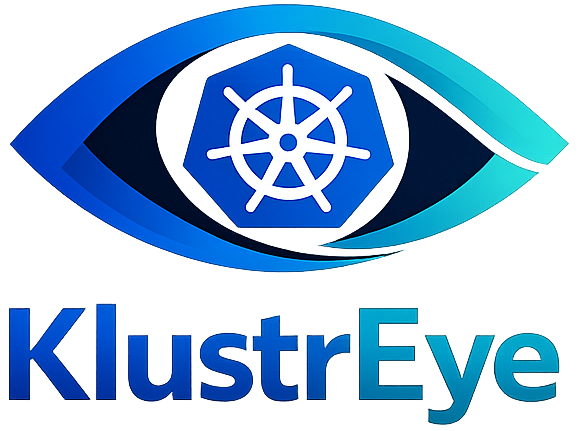
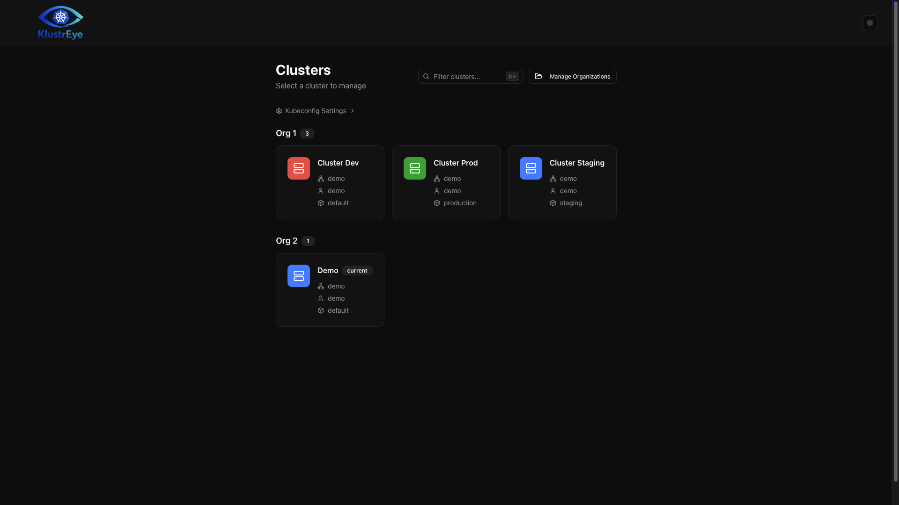
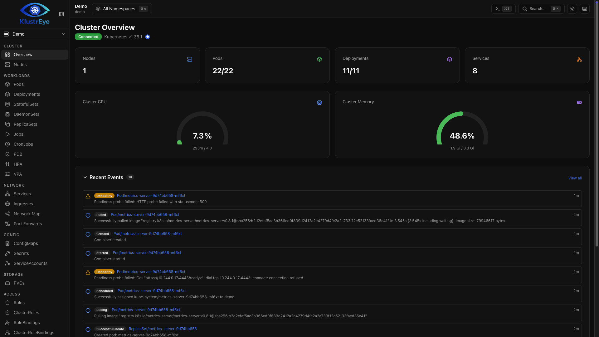
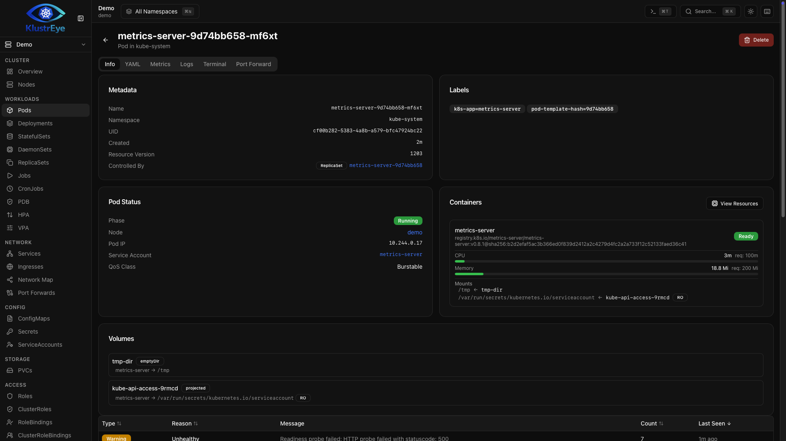

<p align="center">
  
</p>

# KlustrEye

<p align="center">
  
</p>

<p align="center">
  
</p>

<p align="center">
  
</p>

A native desktop Kubernetes IDE built with Tauri, React, and Rust. Connect to real clusters via kubeconfig and manage workloads, view logs, open pod terminals, manage Helm releases, and more — all from a lightweight native app.

## Features

### Cluster Management
- **Multi-cluster support** — connect to any number of clusters from your kubeconfig
- **Cluster organizations** — group clusters by organization (e.g. Production, Staging) with a manage dialog and grouped home page layout
- **Cloud provider detection** — automatically detects EKS, GKE, and AKS clusters from server URLs and version strings, with provider icons on the home page and overview
- **Per-cluster color schemes** — 16 color presets across the OKLCH color wheel for visually distinguishing clusters
- **Cluster renaming** — set custom display names for clusters
- **Sidebar cluster switcher** — quickly switch between clusters, grouped by organization, with search filter and full keyboard navigation
- **Default namespace** — configurable default namespace, display name, and organization assignment via the cluster settings page
- **Cluster shell terminal** — open a local shell scoped to a cluster context (portable-pty + WebSocket backend)

### Workload Management
- **Resource browsing** — view Deployments, StatefulSets, DaemonSets, ReplicaSets, Pods, Jobs, CronJobs, Services, Ingresses, ConfigMaps, Secrets, PVCs, ServiceAccounts, and Nodes
- **Batch operations** — select multiple resources and delete in bulk
- **YAML editing** — edit any resource with a full Monaco Editor with syntax highlighting
- **Resource creation** — create resources from YAML templates
- **Resource detail pages** — detailed view with metadata, events, and YAML tabs
- **Init containers** — view init container status and logs on pod detail pages
- **PVC-pod cross-references** — PVC detail shows bound PV and consuming pods; pod detail lists PVC-backed volumes with links
- **Owner references** — resource detail metadata shows "Controlled By" links to parent resources
- **Secret value reveal** — click eye icon on pod env vars to lazy-fetch and decode base64 secret values inline
- **RBAC Access** — browse and inspect Roles, ClusterRoles, RoleBindings, and ClusterRoleBindings

### Helm
- **Release management** — list, install, and uninstall Helm releases
- **Release detail page** — status, revision, chart version, app version, last deployed time, description, and release notes
- **Values editor** — editable YAML with **Preview Manifest** (dry-run via `helm template`) and **Save & Upgrade** (uses `--atomic` for automatic rollback on failure)
- **Manifest viewer** — full rendered manifest in a read-only Monaco YAML editor
- **History** — revision history table with status badges and one-click rollback

### AI Assistant
- **AI Chat Panel** — collapsible right-side drawer with SSE token-by-token streaming, stop button to abort generation mid-stream, and conversation history (auto-saved, loadable)
- **4 LLM Providers** — Anthropic Claude, OpenAI (ChatGPT), Ollama (local/offline, no API key), Azure OpenAI; Rust backend proxy keeps API keys server-side
- **AI Settings** — provider selector, write-only API key, model input with dynamic Ollama dropdown, Test Connection, and Remove Settings at `/settings/ai`
- **Generate with AI** — describe a resource in plain text; AI streams YAML into the Create Resource dialog; one click inserts it into the editor
- **Inline AI Actions** — "Explain This" on any resource detail page (suppressed for Secrets/ConfigMaps), "Diagnose" on Pod detail (sends phase + events), "Analyze Logs" in LogViewer (sends filtered tail, capped at 4 k chars), "Analyze Events" in the Events tab
- **Token safety** — log lines, YAML, and events are hard-truncated server-side (logs/YAML: 4,000 chars; events: 2,000 chars) before forwarding to the provider
- **Privacy warnings** — one-time banner when log lines are sent to a non-Ollama provider; never shown for local Ollama

### Monitoring & Debugging
- **Pod logs** — real-time streaming via the Kubernetes Log API with search and filtering
- **Pod terminal** — interactive terminal sessions via xterm.js and WebSocket
- **Node and pod metrics** — CPU and memory usage from metrics-server with SVG gauge charts on cluster overview
- **Historical metrics** — Grafana/Mimir integration for historical CPU and memory charts on pod and node detail pages
- **Events** — cluster-wide and resource-scoped event viewing with expandable messages and sortable columns
- **Port forwarding** — create port forwards with automatic browser open

### Plugin System
- **Dynamic plugin architecture** — drop-in plugin directories under `src/plugins/` with auto-discovery
- **Self-contained plugins** — each plugin bundles its own manifest, components, settings panel, and page
- **Resource extensions** — plugins can inject UI into pod and node detail pages (e.g. historical metrics tabs, cost cards)
- **Sidebar integration** — plugins with `hasPage: true` appear automatically under an "Integrations" sidebar section
- **Grafana plugin** — built-in Grafana/Mimir plugin for historical CPU and memory charts on pod and node detail pages
- **OpenCost plugin** — Kubernetes cost monitoring with three backends: OpenCost REST API, Prometheus, or Mimir/Grafana. Allocation breakdown by namespace, pod, and node; cluster-level hourly rate and monthly estimate on the overview page; per-pod and per-node cost cards in resource detail pages. Filters metrics by cluster label (auto-extracted from EKS ARN / GKE context)

### Network
- **Network Map** — visual topology diagram showing Ingress → Service → Pod relationships using React Flow with auto-layout (dagre), click-to-navigate, and namespace filtering
- **Traefik IngressRoute support** — automatically discovers Traefik IngressRoute CRDs and displays them in the network map
- **Service endpoints** — service detail page shows Endpoints with ready/not-ready status, IPs, ports, and target pod references

### Search & Navigation
- **Browser-style tabs** — Ctrl/Cmd+click or middle-click any link to open in a new tab; tabs persist per cluster via localStorage
- **Multi-term pipe filter** — resource table filter supports `|`-separated terms (e.g. `alloy|Running` matches rows containing both terms)
- **URL-synced filters** — resource table filter is stored in the `?filter=` URL parameter
- **Command palette** — quick navigation to any page or resource (Cmd+K / Ctrl+K)
- **Global resource search** — search across all resource types in a cluster
- **Saved searches** — save frequently used filter queries, accessible from the sidebar and command palette
- **Custom Resource Definitions** — browse and manage CRDs and their instances
- **Keyboard shortcuts** — Cmd+T / Ctrl+T to open cluster shell terminal

### Responsive Design
- **Light/dark mode** — manual toggle with system preference detection
- **Mobile sidebar** — off-canvas drawer with backdrop on small screens
- **Adaptive tables** — responsive column hiding at different breakpoints
- **Lightweight window** — native OS webview via Tauri (no bundled Chromium)

## Tech Stack

| Layer | Technology |
|-------|-----------|
| Desktop wrapper | Tauri v2 (Rust) |
| UI | React 19 + Vite (TypeScript, SPA) |
| Routing | React Router v7 |
| API server | Axum 0.7 (Rust, async/Tokio) |
| Database | SQLite via SQLx (no ORM, no Docker needed) |
| Styling | Tailwind CSS 4 with OKLCH color system |
| Server State | TanStack React Query |
| Client State | Zustand (persisted stores) |
| K8s Client | kube-rs v0.97 |
| Helm | Helm CLI via `--kube-context` |
| Terminal | xterm.js + WebSocket + portable-pty (Rust) |
| Editor | Monaco Editor (YAML) |
| Tables | TanStack React Table |
| Charts | Recharts |
| Network Graph | React Flow (`@xyflow/react`) with dagre auto-layout |

## Architecture

```
┌─────────────────────────────────────────────────┐
│               Tauri v2 (Rust)                    │
│  Native window · DB path · port detection        │
└──────────────┬──────────────────────────────────┘
               │
      ┌────────┴────────┐
      │                 │
 ┌────▼──────┐   ┌──────▼──────────────────────┐
 │  WebView  │   │   Axum Backend (Rust)        │
 │ React SPA │◄──►  :auto (47291 default)       │
 │  (Vite)   │   │   ├─ REST  /api/**           │
 └───────────┘   │   ├─ WS    /ws/terminal/*    │
                 │   ├─ WS    /ws/shell/*        │
                 │   └─ SQLite (sqlx)            │
                 └──────────┬──────────────────┘
                            │
                 ┌──────────▼──────────┐
                 │  Kubernetes API      │
                 │  (kube-rs)           │
                 └─────────────────────┘
```

Everything except the React UI runs as native Rust — the HTTP server, Kubernetes API calls, database, terminal PTY, and port-forwarding. The backend binary is embedded inside the `.app` bundle and spawned at startup; no Node.js or external runtime is required.

## Getting Started

Download the latest release for your platform from the [Releases](https://github.com/joli-sys/KlustrEye/releases) page — no installation required, just open the app.

**Requirements:**
- A valid kubeconfig file (`~/.kube/config`)
- Helm CLI — optional, only needed for Helm features

That's it. No Node.js, no Docker, no runtime to install.

## Development

**Prerequisites:**
- Rust toolchain (stable)
- Node.js 20+
- Tauri prerequisites for your OS — see [Tauri docs](https://v2.tauri.app/start/prerequisites/)

```bash
npm install
npm run tauri:dev        # Vite + Axum backend + native window
npm run tauri:build      # Build .app/.dmg (macOS), .AppImage (Linux), .exe/.msi (Windows)
```

| Command | Description |
|---------|-------------|
| `npm run tauri:dev` | Start Tauri desktop app in dev mode |
| `npm run tauri:build` | Build production Tauri desktop binary |
| `npx tsc --noEmit` | Type-check frontend |
| `cargo build -p backend` | Build Rust backend only |

## Project Structure

```
src/                          # React frontend (Vite)
  App.tsx                     # Root router (React Router v7)
  app/clusters/[contextName]/ # Cluster-scoped pages
    overview/
    workloads/                # Pods, Deployments, StatefulSets, etc.
    network/                  # Services, Ingresses, Network Map
    config/                   # ConfigMaps, Secrets, ServiceAccounts
    storage/                  # PVCs
    access/                   # RBAC — Roles, ClusterRoles, Bindings
    helm/                     # Helm releases list + detail
    events/
    settings/
    nodes/
    crds/
  components/
    ui/                       # Base UI primitives (shadcn/ui pattern)
    network-map/              # Network topology diagram (React Flow)
  hooks/                      # React Query hooks
  lib/
    plugins/                  # Plugin system types and registry
    stores/                   # Zustand stores
  plugins/
    grafana/                  # Grafana/Mimir plugin (historical metrics)
    opencost/                 # OpenCost plugin (cost monitoring)

backend/                      # Rust Axum server
  src/
    routes/                   # REST API handlers
      clusters.rs
      resources.rs
      logs.rs
      metrics.rs
      helm.rs
      port_forward.rs
      organizations.rs
      settings.rs
    k8s/                      # Kubernetes client wrappers
    ws/                       # WebSocket terminal + shell handlers
    db.rs                     # SQLite pool + schema migrations
    error.rs                  # AppError → JSON response

src-tauri/                    # Tauri desktop wrapper
  src/lib.rs                  # App setup, backend spawn, port detection
  tauri.conf.json
```

## Database

SQLite is created automatically on first launch at:

- macOS: `~/Library/Application Support/KlustrEye/klustreye.db`
- Linux/Windows: `~/.config/KlustrEye/klustreye.db`

| Table | Purpose |
|-------|---------|
| `organizations` | Cluster groupings |
| `cluster_contexts` | Per-cluster metadata (display name, namespace) |
| `cluster_settings` | Key-value settings per cluster (color scheme) |
| `saved_templates` | YAML templates for resource creation |
| `terminal_sessions` | Terminal session tracking |
| `port_forward_sessions` | Active port forward state |
| `user_preferences` | Global user preferences |

## Architecture Notes

- **No authentication** — designed for local or trusted-network use
- **Kubeconfig only** — cluster discovery uses kubeconfig contexts exclusively
- **No Node.js** — the backend is pure Rust; no Node.js runtime is bundled or required
- **Light/dark mode** — manual toggle with system preference detection on first launch

## Links

- [GitHub](https://github.com/joli-sys/KlustrEye)
- [Jiří Oláh](https://o-li.cz)

## Contributing

Contributions are welcome!

1. **Fork** the repository and create a feature branch from `main`
2. **Make your changes** — follow the existing code style and patterns
3. **Test locally** — run `npm run tauri:dev` and verify your changes against a real cluster
4. **Type-check** — run `npx tsc --noEmit` and `cargo build -p backend`
5. **Submit a pull request** — describe what you changed and why

Please open an issue first for large changes or new features.

## License

This project is licensed under the [MIT License](LICENSE).

Copyright (c) 2026 Jiří Oláh
